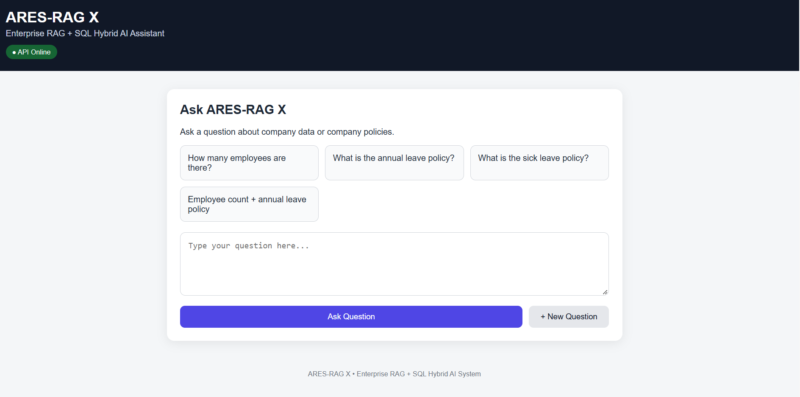
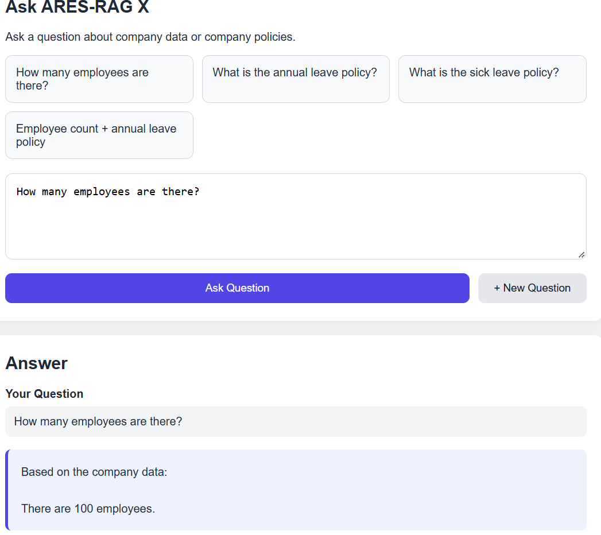
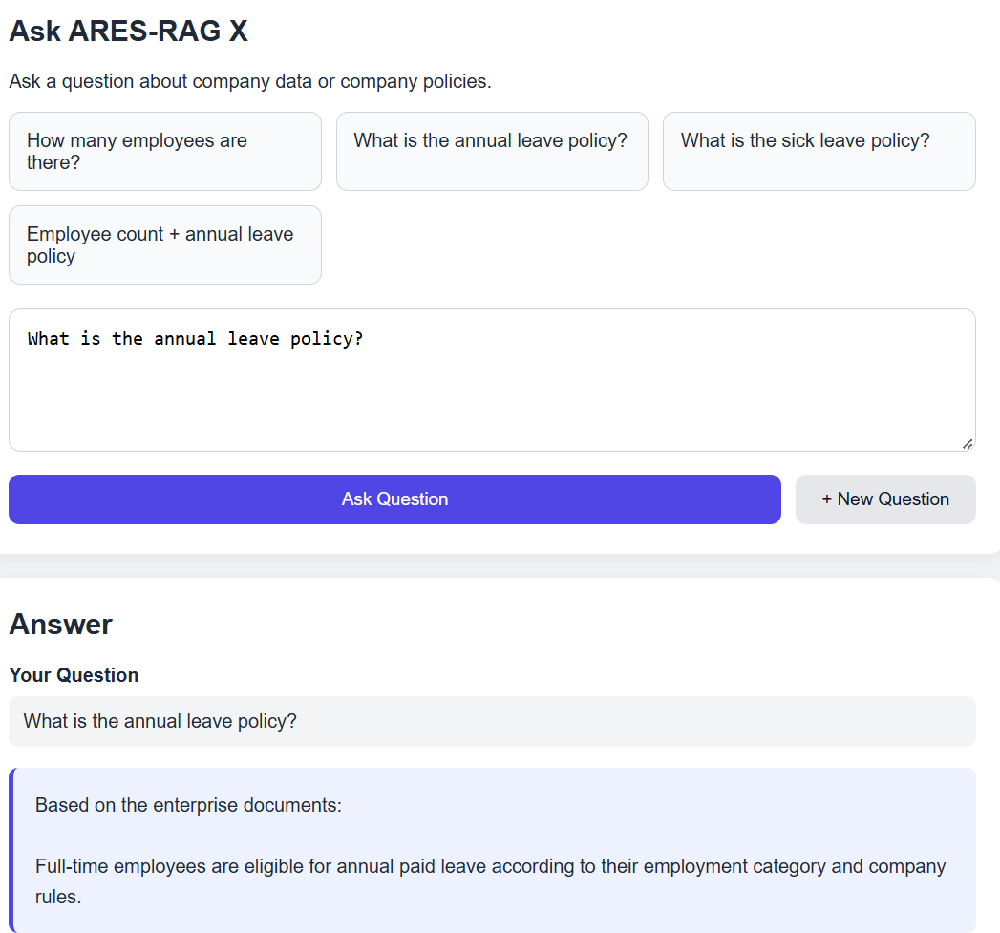

# ARES-RAG-X

**Enterprise Retrieval-Augmented Generation (RAG) system for intelligent document and database question answering.**

ARES-RAG-X is an AI-powered enterprise assistant that can understand a user's question and retrieve information from **company documents or structured databases**. It combines RAG, semantic search, SQL generation, LLMs, and multiple retrieval-quality techniques to provide grounded answers.

## 🚀 Key Features

* 📄 **Document Question Answering** — Retrieves relevant information from enterprise documents.
* 🗄️ **Database Question Answering** — Converts natural-language questions into SQL queries and retrieves structured data.
* 🔀 **Hybrid RAG + SQL Architecture** — Automatically handles document-based and database-based questions.
* 🔎 **Semantic Search** — Uses vector embeddings to find relevant document content.
* 🎯 **Cross-Encoder Reranking** — Improves the relevance of retrieved results.
* 🧠 **HyDE** — Generates hypothetical documents to improve retrieval for complex questions.
* 🔄 **CRAG** — Evaluates retrieval quality and performs corrective retrieval when necessary.
* 🤖 **Self-RAG** — Adds additional evaluation and reflection during answer generation.
* 🛡️ **Guardrails** — Helps prevent inappropriate or unsafe queries and responses.
* ⚡ **Semantic Cache** — Reuses answers for similar questions to reduce processing time.
* 🦙 **Local LLM** — Uses Ollama for local language-model inference.

## 🏗️ System Architecture

```text
                    User Question
                          │
                          ▼
                ┌──────────────────┐
                │ Query Processing │
                └────────┬─────────┘
                         │
             ┌───────────┴───────────┐
             ▼                       ▼
      Document Query            Database Query
             │                       │
             ▼                       ▼
      Vector Retrieval          Text-to-SQL
             │                       │
             ▼                       ▼
      Cross-Encoder             SQLite Database
        Reranking                    │
             │                       │
             └───────────┬───────────┘
                         ▼
                  Hybrid Coordinator
                         │
                         ▼
                  LLM Answer Generation
                         │
                         ▼
                  Grounded Response
```

## 🧠 RAG Pipeline

The document retrieval pipeline includes:

1. Document ingestion
2. Text chunking
3. Embedding generation
4. Semantic retrieval
5. Keyword-based retrieval
6. Cross-Encoder reranking
7. Context generation
8. LLM response generation

The system also includes **HyDE, CRAG, and Self-RAG** techniques to improve retrieval and answer quality.

## 🗄️ Database Question Answering

ARES-RAG-X can answer questions from structured enterprise data using natural language.

Example:

```text
User:
How many employees are there?

System:
100 employees
```

Another example:

```text
User:
How many departments are there?

System:
6 departments
```

The system converts appropriate natural-language questions into SQL and executes them against the SQLite database.

## 🔍 Retrieval Technology

ARES-RAG-X uses:

* **FastEmbed**
* **BAAI/bge-small-en-v1.5**
* **Semantic similarity search**
* **Keyword normalization**
* **Cross-Encoder reranking**
* **ms-marco-MiniLM-L-6-v2**

This combination helps the system retrieve relevant information before generating the final response.

## 📊 Evaluation

The retrieval and answer-generation pipeline was evaluated using a project-specific test set.

| Metric                   | Result |
| ------------------------ | -----: |
| Top-1 Retrieval Accuracy |    90% |
| Top-3 Retrieval Accuracy |   100% |
| Top-5 Retrieval Accuracy |   100% |
| Answer Accuracy          |   100% |
| Groundedness             |    75% |

## 🛠️ Technologies

### Programming

* Python
* SQL

### AI / Machine Learning

* Retrieval-Augmented Generation
* Large Language Models
* Embeddings
* Semantic Search
* Cross-Encoder Reranking
* HyDE
* CRAG
* Self-RAG

### Frameworks & Libraries

* FastEmbed
* Scikit-learn
* FastAPI
* NumPy
* Pandas

### Database

* SQLite

### LLM

* Ollama
* Llama 3.2 3B

### Development

* VS Code
* Git
* GitHub

## 📁 Project Structure

```text
ARES-RAG-X/
│
├── main.py
├── api.py
├── rag_agent.py
├── sql_agent.py
├── hybrid_coordinator.py
│
├── src/
│   ├── retriever/
│   ├── Text2SQL/
│   ├── query_engine/
│   ├── guardrails/
│   ├── HyDE/
│   ├── CRAG/
│   └── Self-RAG/
│
├── data/
│   └── database/
│       └── nova_corp.db
│
├── README.md
└── .gitignore
```

## ⚙️ Installation

### 1. Clone the repository

```bash
git clone https://github.com/santhoshmadhavan016-ops/ARES-RAG-X.git
cd ARES-RAG-X
```

### 2. Create a virtual environment

```bash
python -m venv .venv
```

Activate it on Windows:

```bash
.venv\Scripts\activate
```

### 3. Install dependencies

```bash
pip install -r requirements.txt
```

### 4. Start Ollama

Make sure Ollama is installed and running.

Pull the required model:

```bash
ollama pull llama3.2:3b
```

### 5. Run the application

```bash
python main.py
```

If using the FastAPI interface:

```bash
python api.py
```

## 💡 Example Questions

ARES-RAG-X can handle questions such as:

### Database

```text
How many employees are there?
How many departments are there?
Which department has the most employees?
```

### Documents

```text
What is the annual leave policy?
What is the company policy for employees?
```

The system determines whether the question requires **structured database information or document-based knowledge**.

## 🎯 Project Objective

The main objective of ARES-RAG-X is to build an enterprise AI assistant capable of answering questions from both **unstructured documents and structured databases** through a unified natural-language interface.

Instead of requiring users to manually search documents or write SQL queries, the system allows them to ask questions naturally.

## 🔮 Future Improvements

* Web-based enterprise dashboard
* Authentication and role-based access
* More enterprise document formats
* Cloud deployment
* Advanced monitoring and observability
* Improved groundedness and factual verification
* Multi-database support

## Screenshots

### ARES-RAG Interface



### Database Query



### Document Query



## 👨‍💻 Author

**Santhosh Madhavan**

B.Tech – Computer Science and Engineering
Artificial Intelligence & Data Science
Joy University

---

⭐ If you find this project interesting, consider giving the repository a star.
